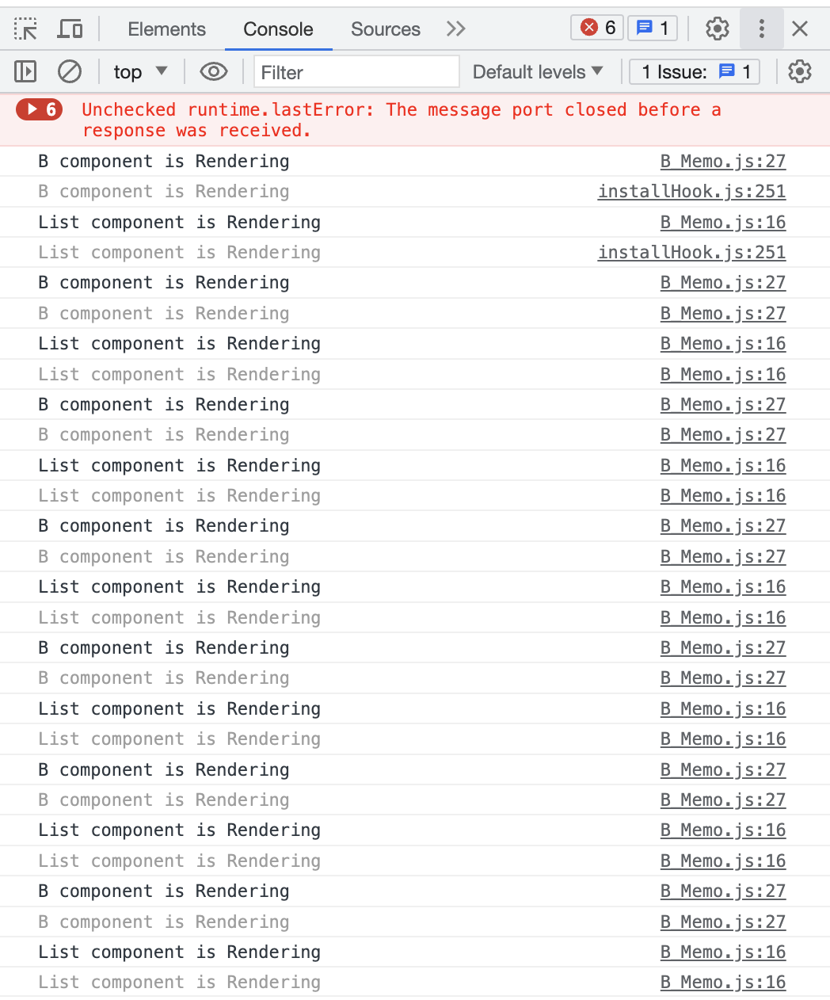
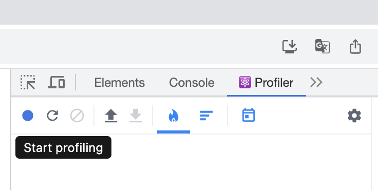
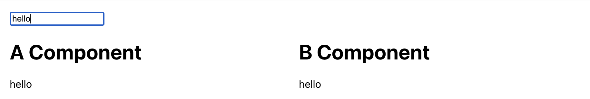
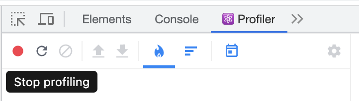
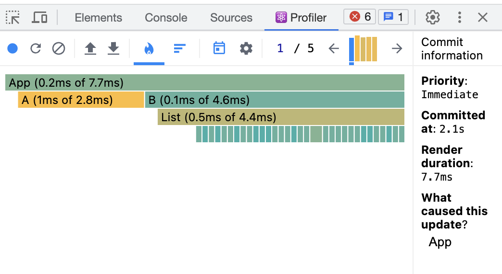
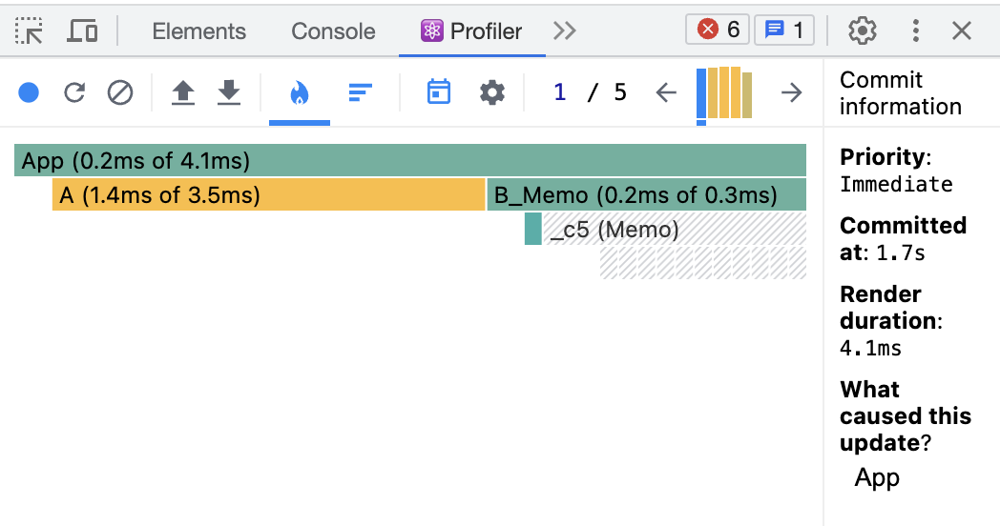

# 리액트 앱 성능 개선하기

<br>

# useMemo를 이용한 최적화

- A.js - 모든 요소를 하나의 컴포넌트에 작성

- B.js - 여러 컴포넌트로 나눠서 작성

<br>



<br><br>

# React Profiler로 성능 측정

- 프로파일링을 수행해서 성능 데이터를 기록하고 측정

- Profiler는 컴포넌트가 재렌더링이 될 때마다 성능을 기록

<br>



start profiling (파란) 버튼 클릭

<br>



hello 입력

<br>



stop profiling (빨간) 버튼 클릭

<br>



- A 컴포넌트가 B 컴포넌트 보다 성능이 좋음

<br><br>

# 현재 B 컴포넌트의 문제점 

- 현재 B 컴포넌트는 B, List, ListItem, Messsage 컴포넌트로 나뉘어져 있음
  - 재사용성을 위해
  - 각 컴포넌트의 렌더링의 최적화를 위해

- Input에서 글을 타이핑 할 때 원래는 Message 컴포넌트와 그 State 값을 가지고 있는 App 컴포넌트만 되어야 하는데 현재는 상관이 없는 다른 부분까지 렌더링 되고 있음

<br><br>

# React.memo를 이용하여 성능 최적화

각 컴포넌트를 React.memo()로 감싸주면 필요한 부분만 렌더링 됨

```javascript
const Message = React.memo(({ message }) =>{
  return <p>{message}</p>;
})

const ListItem = React.memo(({ post }) => {
  return (
    <li key={post.id}>
      <p>{post.title}</p>
    </li>
  );
})

const List = React.memo(({ posts }) => {
  return (
    <ul>
      {posts.map(post => 
        <ListItem key={post.id} post={post} />
      )}
    </ul>
  );
})
```

<br><br>

# React Profiler 재측정



- B 성능 향상

<br><br>

# React.memo() 
- React는 먼저 컴포넌트를 렌더링한 뒤, 이전에 렌더링 된 결과와 비교하여 DOM 업데이트를 결정

- 렌더링 결과가 이전과 다르다면, React는 DOM을 업데이트 함

- 이 과정에서 만약 컴포넌트가 React.memo()로 둘러 쌓여 있다면, React는 컴포넌트를 렌더링하고 결과를 메모이징(Memoizing)한다. 그리고 다음 렌더링이 일어날 때 렌더링하는 컴포넌트의 props가 같다면 React는 메모이징된 내용을 재사용함

- 메모이제이션(Memoization) : 주어진 입력값에 대한 결과를 저장함으로써 같은 입력값에 대해 함수가 한번만 실행되는 것을 보장

<br><br>

# React Memo가 props를 비교하는 방법

React.memo()는 props 혹은 props의 객체를 비교할 때 **얕은 (shallow) 비교**를함

### 얕은 비교
- 숫자, 문자열 등 원시 자료형은 값을 비교

- 배열, 객체 등 참조 자료형은 값 혹은 속성을 비교하지 않고, 참조되는 위치를 비교

- React.memo()에서 props를 비교할 때, 리액트 컴포넌트가 리렌더링을 하기 전 얕은 비교 사용

### 깊은 비교
- 얕은 비교와 달리 깊은 비교는 객체의 경우에도 값으로 비교

- Object depth가 깊지 않은 경우: JSON.stringify() 사용

- Object depth가 깊은 경우: lodash 라이브러리의 isEqual() 사용

### 리액트가 리렌더링 되는 경우
- state 변경이 있을 때

- 부모 컴포넌트가 렌더링 될 때

- 새로운 props이 들어올 때

- shouldComponentUpdate에서 true가 반환될 때

- forceUpdate가 실행될 때

<br><br>

# React Meomo의 Props 비교 방식 수정하기 

비교 방식을 원하는 대로 수정하고 싶다면 React.memo()의 두 번째 매개변수로 비교함수를 넣어주면 됨

```javascript
// a, b, c, d 중에 a와 b만 비교하고 싶을 때
React.memo(Component, [compareFunction(prevProps, nextProps)])

function compareFunction(prevProps, nextProps) {
  return (
    prevProps.a === nextProps.a &&
    prevProps.b === nextProps.b
  )
}
```

<br><br>

### ❗️React.memo 사용은 항상 좋은 것은 아니기에 profiler를 이용해서 성능 상 이점이 있는지 확인 후 사용

<br><br>

# 2. useCallback을 이용한 최적화
컴포넌트가 렌더링 될 때 그 안에 있는 함수도 다시 만들게 됨

하지만 똑같은 함수를 컴포넌트가 리렌더링 된다고 해서 계속 만드는 것은 비효율적

컴포넌트가 리렌더링될 때마다 함수를 계속 다시 만들어 이 함수가 자식 컴포넌트에 props로 내려준다면 함수를 포함하고 있는 컴포넌트가 리렌더링될 때마다 자식 컴포넌트도 함수가 새롭게 만들어지니 계속 리렌더링 하게됨
